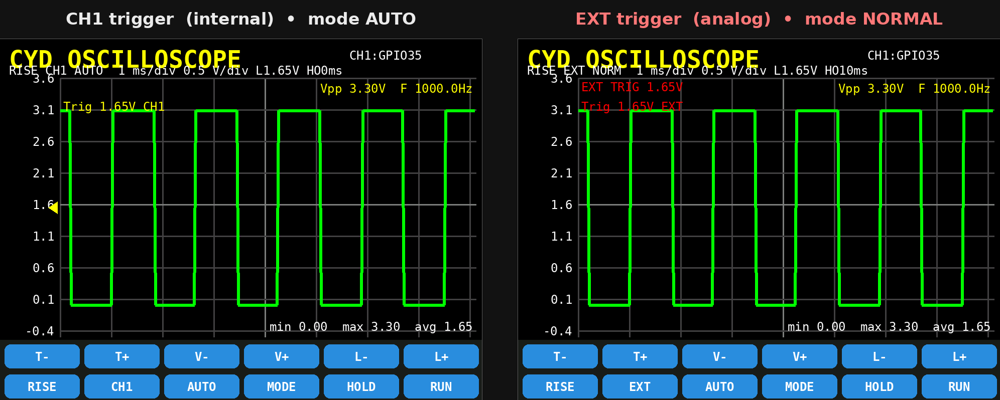
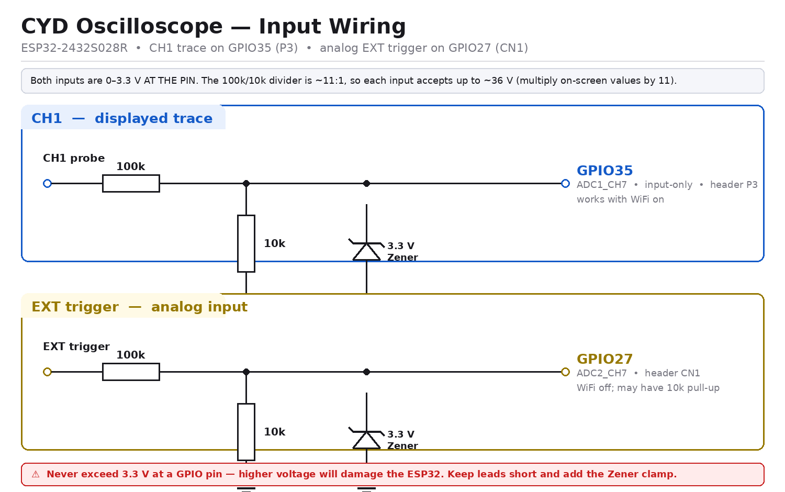

# CYD Oscilloscope — Single-Channel Scope with External Trigger on the "Cheap Yellow Display"

Turn a **$10 ESP32-2432S028R "Cheap Yellow Display" (CYD)** into a usable, touch-controlled
single-channel oscilloscope **with a separate external-trigger input**. No external ADC, no
op-amps required for a first build — the ESP32's built-in 12-bit ADC does the sampling and the
2.8" TFT draws the trace.



---

## 1. What you get

| Feature | Detail |
|---|---|
| Channels | 1 displayed trace (**GPIO35**, ADC1_CH7) |
| Trigger sources | **CH1** (internal) or **EXT** (GPIO27, ADC2_CH7) |
| ADC resolution | 12-bit (0–4095) |
| Input range | 0 – 3.3 V (11 dB attenuation) |
| Timebase | 50 µs/div … 50 ms/div (10 steps) |
| Vertical scale | 0.1, 0.2, 0.5, 1, 2 V/div |
| Trigger | Rising / falling edge, **analog** level + hysteresis, CH1 or EXT source |
| Trigger levels | **Independent per source** (CH1 and EXT each keep their own level) |
| Trigger helpers | **AUTO** button (auto-sets level to source mid-point) |
| Trigger modes | **AUTO** (free-run), **NORMAL** (hold until edge), **SINGLE** (one-shot) |
| Holdoff | Adjustable dead time 0–200 ms (8 steps) between sweeps |
| Display | 320×240, 8×8 grid divisions |
| Measurements | Vmin, Vmax, Vpp, Vavg, frequency (on CH1) |
| Controls | On-screen touch buttons (T-, T+, V-, V+, L-, L+, RISE/FALL, CH1/EXT, AUTO, MODE, HOLD, RUN/ARM) |
| Sample rate | Up to ~100 ksps (software-timed) |

> **Reality check:** This is a *hobby-grade* scope. The ESP32 ADC is noisy and non-linear,
> and software-timed sampling tops out around 100 ksps. It's perfect for audio, PWM,
> sensor signals, and learning — **not** for RF or precision measurement. See §9 for limits.

---

## 2. Hardware

### The board
The **ESP32-2432S028R** ("CYD") contains:
- ESP32-WROOM-32 (dual-core, 240 MHz, WiFi/BT)
- 2.8" 240×320 ILI9341 TFT on **HSPI**
- XPT2046 **resistive** touch on **VSPI**
- microSD slot, RGB LED, LDR, speaker header, two USB ports (varies by revision)

### The two ADC pins on the header
The CYD exposes very few free pins, but two of them are ADC-capable — and that's exactly
what this build uses:

| Pin | ADC | Header | Used for |
|---|---|---|---|
| **GPIO35** | ADC1_CH7 | **P3** | **CH1** — the displayed trace (input-only pin) |
| **GPIO27** | ADC2_CH7 | **CN1** | **EXT** — the external trigger input |

Why these two?
- **ADC1 (GPIO35)** works even while WiFi is active and is a clean input-only pin → ideal for CH1.
- **ADC2 (GPIO27)** is the only other ADC pin on the header. It's perfect as a **trigger-only**
  input because we only need to detect an edge on it — we never have to trust its absolute value.

Other exposed pins: **GPIO22** (P3/CN1, not ADC — fine for I2C), **GPIO21** (used by the
backlight). So GPIO35 + GPIO27 are the two analog pins, and this design uses both: one to
look at, one to trigger on.

### Wiring (minimum build)

```
        CYD P3 (CH1)                         CYD CN1 (EXT trigger)
        ┌───────────────┐                    ┌───────────────┐
 GND ───┤ GND           │             GND ───┤ GND           │
 GPIO35 ┤───────────────┼──► CH1 probe  GPIO27 ┤───────────────┼──► TRIGGER signal
 GPIO22 ┤               │              GPIO22 ┤               │
 GPIO21 ┤               │              3V3    ┤               │
        └───────────────┘                    └───────────────┘
```



**Absolute maximum on either pin: 3.3 V.** Exceeding it will damage the ESP32.

> **Caveats for the EXT pin (GPIO27):**
> - It is **ADC2**, which is shared with the WiFi radio. **Turn WiFi off** to use the EXT
>   trigger; ADC2 reads fail while WiFi is active.
> - Some CYD revisions fit a **10k pull-up** on GPIO27 (so it idles near 3.3 V when
>   undriven), and a few revisions leave the CN1 "GPIO27" pad **unconnected**. Verify with a
>   multimeter before relying on it.
> - Because of the pull-up, drive GPIO27 with a real signal (a push-pull output or a
>   buffered source). If you only have a weak/high-impedance source, add a buffer.

---

## 3. Input conditioning (recommended)

### 3a. CH1 front-end — protection + bias (minimum, do this)
```
 probe ──[ 100k ]──┬── GPIO35
                   │
              [ 10k ]  (to GND)
                   │
                  GND
```
- The 100k/10k divider gives a ~11:1 attenuation → **0–36 V input range** (multiply the
  displayed value by 11).
- Add a **3.3 V Zener or Schottky clamp** from GPIO35 to GND and to 3V3 for safety.

### 3b. CH1 AC coupling + bias (for audio / AC signals)
```
 probe ──[ 100nF ]──┬── GPIO35
                    │
               [ 100k ]   (to 1.65 V mid-rail)
                    │
                 1.65 V
```
Centres an AC signal around 1.65 V so the full ±1.65 V swing fits the ADC range. Build the
1.65 V rail with two equal resistors (e.g. 10k/10k) from 3V3 to GND.

### 3c. EXT trigger front-end (analog)
The external trigger is treated as an **analog** input: the firmware compares the GPIO27
voltage against an adjustable level (with a hysteresis band), so any waveform — not just a
logic edge — can trigger the scope. Condition it the same way you would any ADC input:

```
 TRIGGER ──[ 100k ]──┬── GPIO27
 (0–36 V)            │
                [ 10k ]  (to GND)
                     │
                    GND
```

- The 100k/10k divider gives the same ~11:1 attenuation as CH1 → **0–36 V trigger range**
  (remember to multiply the on-screen trigger level by 11 when you read it back).
- Add a **3.3 V Zener / Schottky clamp** from GPIO27 to GND and to 3V3 for protection.

Because the level is analog, you can trigger on the **mid-point of a sine wave**, a slow ramp,
a sensor output, or any signal that never reaches a clean logic rail. If your trigger source is
a logic signal (0/3.3 V), wire it directly and press **AUTO** — the firmware will set the level
to ~1.65 V, which is exactly where a logic edge crosses.

---

## 4. Software setup

### 4.0 Libraries are included (nothing to download)
This project **ships both required libraries** in the `libraries/` folder, already
configured, so it compiles without touching the Library Manager:

```
libraries/
├── TFT_eSPI/                 ← Bodmer's TFT_eSPI, pre-configured for the CYD
│   └── User_Setup.h          ← our CYD setup (already in place)
└── XPT2046_Touchscreen/      ← Paul Stoffregen's touch driver
```

Pick **one** of the two setups below.

> ✅ **Verified build.** This exact tree was compiled with PlatformIO
> (`platform = espressif32`, Arduino core 2.0.17, TFT_eSPI 2.5.43,
> XPT2046_Touchscreen 1.4): **SUCCESS** — RAM 7.6 %, Flash 24.7 %. No missing
> libraries, no manual edits.

### 4.1a Arduino IDE — install the bundled libraries
Run the helper script (Linux/macOS):

```bash
./install_libraries.sh
```

It copies `libraries/TFT_eSPI` and `libraries/XPT2046_Touchscreen` into your
`~/Arduino/libraries/` folder. Then restart the IDE.

**Windows / manual:** copy the two folders inside `libraries/` into
`Documents\Arduino\libraries\`. The bundled `TFT_eSPI` **already contains the correct
`User_Setup.h`**, so you do **not** need to edit anything.

> Prefer the Library Manager? Install **TFT_eSPI** (Bodmer) and **XPT2046_Touchscreen**
> (Stoffregen) as usual, then **replace** `.../Arduino/libraries/TFT_eSPI/User_Setup.h`
> with the one in `ESP32_CYD_Oscilloscope/User_Setup.h`. It sets `ILI9341_2_DRIVER`,
> `TFT_WIDTH 240`, `TFT_HEIGHT 320`, display SPI pins 12/13/14/15/2, backlight 21 and
> `USE_HSPI_PORT` (critical — the CYD display is on HSPI).

### 4.1b PlatformIO — one command
The included `platformio.ini` points at the bundled libraries (`lib_extra_dirs = libraries`),
so you only need to build:

```bash
pio run -t upload
```

(If you'd rather fetch the libraries from the registry, comment out `lib_extra_dirs`
and uncomment the `lib_deps` block in `platformio.ini`.)

> **White screen?** Some newer CYD revisions ship with an **ST7789** panel. Edit
> `libraries/TFT_eSPI/User_Setup.h`: comment out `#define ILI9341_2_DRIVER` and uncomment
> `#define ST7789_DRIVER` + `#define TFT_INVERSION_OFF`.

### 4.2 Board settings (Arduino IDE)
- **Board:** ESP32 Dev Module
- **Upload Speed:** 115200 (drop if flashing fails)
- **Flash Size:** 4MB
- If upload stalls, hold **BOOT**, tap **RST**, release **BOOT**.

### 4.3 Upload
Open `ESP32_CYD_Oscilloscope/ESP32_CYD_Oscilloscope.ino`, select your COM port, and upload.

---

## 5. Using the scope

| Button | Action |
|---|---|
| **T-** / **T+** | Slower / faster timebase (time per division) |
| **V-** / **V+** | More / less volts per division (zoom vertical) |
| **L-** / **L+** | Move the **active source's** trigger level down / up (0.05 V steps) |
| **RISE / FALL** | Toggle trigger edge (label shows current edge) |
| **CH1 / EXT** | Toggle trigger **source** (label shows current source) |
| **AUTO** | Auto-set the active source's trigger level to the mid-point of its min/max |
| **MODE** | Cycle trigger mode: **AUTO → NORMAL → SINGLE** |
| **HOLD** | Cycle holdoff dead time: 0, 1, 5, 10, 20, 50, 100, 200 ms |
| **RUN / STOP / ARM** | Run/stop (AUTO & NORMAL), or **arm** a one-shot capture (SINGLE) |

The status line under the title shows edge, source, **mode**, timebase, volts/div, the **active**
trigger level and the current **holdoff**. The plot overlays show the trigger setting (top-left),
Vpp/frequency (top-right) and min/max/avg (bottom-right).

**Independent trigger levels.** CH1 and EXT each remember their **own** trigger level. Switch
the **SRC** button and the **L-/L+** buttons now adjust that source's level; the level you set
for CH1 is preserved while you tune the EXT level, and vice-versa.

**Hysteresis.** The trigger uses a small hysteresis band (~0.08 V, ≈2.4 % of full scale) so a
noisy signal sitting near the level does not produce a jittery, double-triggered trace. If the
band is too wide for a very small signal, the firmware automatically falls back to a plain
level crossing so the trace still locks.

**Triggering on CH1 (default):** the trace locks to its own signal — the classic scope mode.
The yellow arrow on the left edge marks the level on the CH1 scale.

**Triggering on EXT:** press **SRC** to switch to **EXT** and feed a signal into GPIO27. The
displayed CH1 trace now locks to the **external** edge, so you can view a signal that is itself
hard to trigger on (noisy, low-amplitude, or non-repetitive) as long as a clean related edge is
available on the trigger input. A red **"EXT TRIG x.xxV"** tag appears on the plot to remind you
the level now refers to the trigger input, not CH1. Press **AUTO** to instantly centre the level
on the external signal's swing.

**AUTO level.** The **AUTO** button samples the active source and sets its trigger level to the
mid-point between the observed minimum and maximum. This is the fastest way to get a stable
trace on an unknown analog signal — especially on the EXT input. (In EXT mode it grabs a fresh
burst of the GPIO27 signal before computing the mid-point.)

---

## 6. How it works

1. **Acquire** — `analogRead()` fills a 276-sample CH1 buffer, one sample per pixel column.
   When the trigger source is **EXT**, the GPIO27 pin is sampled alongside CH1 into a second
   buffer. The inter-sample delay is derived from the timebase:
   `interval = timeDiv / (SAMPLES / DIVS_H)`.
2. **Trigger** — the code scans the **selected source** buffer for the first edge that crosses
   the trigger level in the chosen direction, then **rotates both buffers** by the same amount
   so the crossing lands ~1/8 in from the left. Rotating both keeps CH1 time-aligned to the
   external edge. This gives a stable, non-drifting display. The search is **two-pass**:
   - *Pass 1 (hysteresis):* the signal must first drop below `level − hys` (for a rising edge)
     to **arm**, then rise above `level + hys` to **fire**. The ±0.08 V band rejects noise that
     would otherwise cause false or double triggers.
   - *Pass 2 (fallback):* if no hysteresis edge is found (e.g. a signal smaller than the band),
     a plain `level` crossing is used so the trace still locks.
   - If neither pass finds an edge, `triggerAlign()` reports **no trigger** and the current
     **mode** decides what happens next (see step 3).
3. **Mode & holdoff** — the trigger mode controls what happens when no edge is found:
   - **AUTO** — always draws. If the trigger fired the trace is aligned to it; if not, the
     scope **free-runs** and simply shows the latest capture. (Classic "auto" — never blank.)
   - **NORMAL** — draws **only** when the trigger fires. Otherwise it keeps the last captured
     trace on screen and keeps re-arming. This removes the horizontal jitter you get on an
     unstable signal, at the cost of a "frozen" trace when the signal drifts out of the level.
   - **SINGLE** — one-shot. Press **ARM**, and the very next trigger is captured, drawn, and
     the scope **stops** (the button returns to **ARM**). Perfect for capturing a one-off event.
   After a successful sweep the scope waits **holdoff** (0–200 ms) before the next acquisition.
   Holdoff is a dead time that makes the trigger ignore edges for a while after each sweep —
   handy for stabilising a burst or a waveform with several crossings per period.
4. **Render** — each CH1 sample is mapped to a y-pixel via the volts/div and vertical offset,
   then drawn as a polyline. The previous trace is erased first for a clean refresh.
5. **Measure** — min/max/avg come straight from the CH1 buffer; frequency is estimated from
   rising mean-crossings.

The display refresh and acquisition share the single core, so the frame rate scales with
the timebase (fast timebases refresh quickly; 50 ms/div takes ~1.4 s per sweep).

> **Timing note:** because CH1 and EXT are read sequentially, there is a small (~one ADC
> conversion) skew between them. At fast timebases this slightly shifts the CH1 trace relative
> to the true trigger instant. For tighter alignment, sample both channels with the ADC
> hardware scanner / I2S-DMA (see §7).

---

## 7. Tuning & extending

- **Faster sampling / true simultaneous capture:** use the **I2S/ADC DMA** path or the
  `esp_adc` digital controller with the hardware scanner to sample CH1 and EXT into DMA
  buffers at the same instant, reaching ~1 MSPS bursts.
- **Trigger holdoff is implemented** (0–200 ms via **HOLD**). Possible next steps: a
  continuous (fine) holdoff knob, or an external-trigger holdoff referenced to the EXT edge.
- **Persistence / FFT:** use a second sprite buffer and an FFT (e.g. arduinoFFT) for a
  spectrum view.
- **SD logging:** the CYD has a microSD slot (VSPI) — log captures to CSV.

---

## 8. File list

```
cyd_oscilloscope/
├── ESP32_CYD_Oscilloscope/
│   ├── ESP32_CYD_Oscilloscope.ino   ← main firmware (CH1 + analog EXT trigger)
│   └── User_Setup.h                 ← TFT_eSPI config for the CYD (copy/reference)
├── libraries/                       ← bundled, ready-to-compile dependencies
│   ├── TFT_eSPI/                    ← Bodmer's TFT_eSPI (User_Setup.h pre-applied)
│   └── XPT2046_Touchscreen/         ← Stoffregen's touch driver
├── docs/
│   ├── wiring.png                   ← input wiring (CH1 + analog EXT)
│   ├── ui_mockup.png                ← screen layout mockup (CH1 & EXT modes)
│   ├── render_wiring.py             ← regenerates wiring.png
│   └── render_mockup.py             ← regenerates ui_mockup.png
├── platformio.ini                   ← PlatformIO build (uses ./libraries)
├── install_libraries.sh             ← copies ./libraries into Arduino IDE
├── README.md                        ← this file
└── todo.md                          ← build plan
```

---

## 9. Limitations (read this)

| Limit | Cause | Mitigation |
|---|---|---|
| 0–3.3 V only | ESP32 ADC | Use a divider (§3) |
| ~100 ksps max | software-timed `analogRead` | Use I2S/ADC DMA |
| Noisy / non-linear | ESP32 ADC | Oversample, average, calibrate |
| EXT pin unavailable with WiFi | ADC2 shares the radio | Keep WiFi off in EXT mode |
| GPIO27 pull-up / not connected | board revision differences | Verify with a meter; buffer the source |
| CH1↔EXT sample skew | sequential ADC reads | Use hardware scanner / DMA |
| Frame rate drops at slow timebases | blocking acquisition | DMA + FreeRTOS task |

---

## 10. Troubleshooting

| Symptom | Fix |
|---|---|
| White/blank screen | Wrong driver — switch ILI9341 ↔ ST7789 in `User_Setup.h` |
| Inverted colours | Add `#define TFT_INVERSION_ON` |
| Touch axes swapped | Change `ts.setRotation(1)` to `3` |
| Touch offset | Re-map the `map()` constants in `handleTouch()` |
| No trace | Confirm signal on GPIO35, check trigger level is within signal range |
| Trace drifts / won't lock | Trigger level outside signal swing → press **AUTO**, or adjust **L-/L+** |
| Trace jitters near the level | Increase signal amplitude, or move the level away from a noisy region (hysteresis is fixed at ~0.08 V) |
| EXT mode won't lock | GPIO27 undriven/unconnected, or WiFi is on (ADC2 conflict); press **AUTO** to centre the level |
| Upload fails | Lower upload speed; use BOOT+RST trick |

---

## 11. References

- Random Nerd Tutorials — *Getting Started with the ESP32 Cheap Yellow Display (CYD)*
  https://randomnerdtutorials.com/cheap-yellow-display-esp32-2432s028r/
- Random Nerd Tutorials — *CYD Pinout (ESP32-2432S028R)*
  https://randomnerdtutorials.com/esp32-cheap-yellow-display-cyd-pinout-esp32-2432s028r/
- Espressif — *ESP32 ADC* (ADC1/ADC2 channel map, WiFi conflict)
  https://docs.espressif.com/projects/esp-idf/en/latest/esp32/api-reference/peripherals/adc.html
- witnessmenow — *ESP32-Cheap-Yellow-Display* community repo
  https://github.com/witnessmenow/ESP32-Cheap-Yellow-Display
- Bodmer — *TFT_eSPI* library
  https://github.com/Bodmer/TFT_eSPI
- Paul Stoffregen — *XPT2046_Touchscreen* library
  https://github.com/PaulStoffregen/XPT2046_Touchscreen
- epozzobon — *esp32scope* (I2S/ADC DMA reference)
  https://github.com/epozzobon/esp32scope
